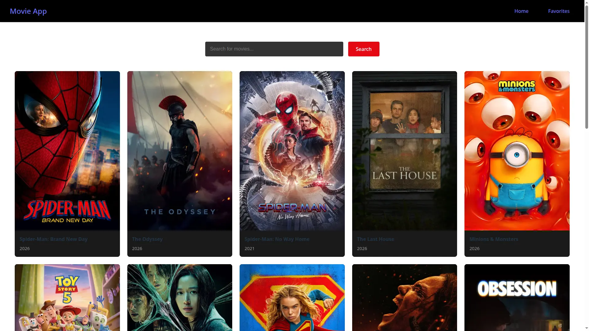
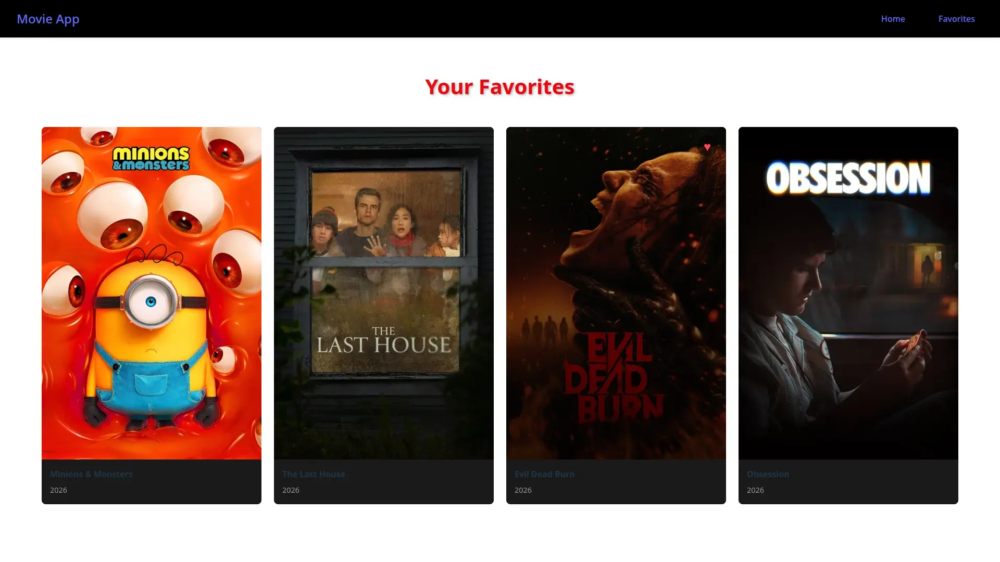

# React Movie List

A movie search and favorites app built with React, using the TMDB API.

## Live Demo
[link once deployed]

## Features
- Browse popular movies on load
- Search movies by title
- Save/remove favorites (persisted in localStorage)

## Tech Stack
- React 19
- React Router
- Vite
- TMDB API

## Running Locally
1. Clone the repo
2. `npm install`
3. Create a `.env` file with: VITE_TMDB_API_KEY=your_key_here
4. `npm run dev`

## Screenshots

### Home

### Favorites

